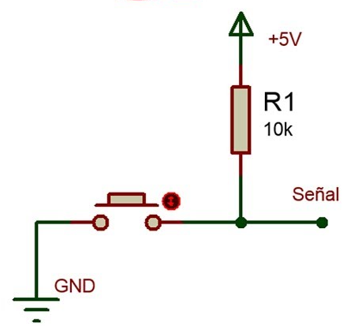
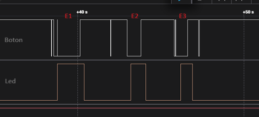
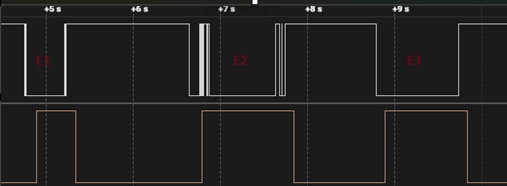

# Ejemplo simple de como leer un gpio

En este ejemplo activo las resistencia de pull up del gpio 4. De esta manera el gpio 4
siempre estara en alto a menos que el boton conectado a este pin este presionado.

### Diagrama PULL UP

### Respuesta con DEBOUNCE 50ms   

Al aumentar el tiempo de debounce, el sistema responde más lentamente, pero mejora el filtrado de ruidos y rebotes del pulsador.

En la gráfica se observa la señal del botón configurado con pull-up, donde al presionarse la señal pasa de nivel alto a bajo. También pueden identificarse tres eventos principales (E1, E2 y E3), en los que aparecen rebotes y transiciones espurias propias del accionamiento mecánico.

El filtrado evita que esos ruidos generen activaciones incorrectas del LED. Una vez que el sistema valida el evento después del tiempo de debounce, el LED cambia de estado y se enciende. En la señal puede apreciarse claramente el pequeño retraso introducido por el filtrado.

### Respuesta con DEBOUNCE 10ms   

Con un tiempo de debounce de 10 ms, el sistema presenta un menor retardo en la respuesta, haciendo que el LED reaccione más rápidamente ante la pulsación del botón. En la gráfica pueden observarse tres eventos principales (E1, E2 y E3).

En el evento E2 se aprecia que la señal del botón contiene ruido tanto al inicio como al final de la pulsación. Aunque el debounce logra evitar múltiples activaciones falsas, esos rebotes modifican ligeramente el ancho efectivo del pulso detectado. Por este motivo, la señal del LED permanece activa durante un tiempo algo mayor, ya que el sistema interpreta el pulso considerando el tiempo total afectado por los rebotes y el filtrado.

En cambio, en el evento E3 la señal prácticamente no presenta ruido, por lo que el funcionamiento es más preciso y la respuesta del LED coincide mejor con la duración real de la pulsación.

### Conclusion final 

En resumen, el tiempo de debounce debe ajustarse según las características del sistema. Un valor pequeño reduce el retardo y mejora la velocidad de respuesta, pero puede dejar pasar parte del ruido. Un valor mayor filtra mejor los rebotes y falsas transiciones, aunque introduce un retraso más evidente en la detección de eventos.